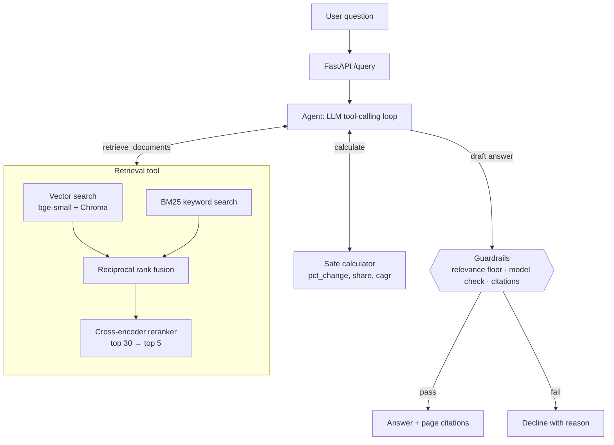

# Consulting Research Copilot

[](https://github.com/Ohm-Kel/consulting-research-copilot/actions/workflows/ci.yml)


An AI research assistant for the desk research a consulting case team does in the first days of
a project. Ask a business question about five companies' annual reports; it finds the relevant
passages and tables, computes figures with a calculator tool, and answers with **page-level
citations**. When the reports do not support an answer, it **declines instead of guessing**.

```
Q: How did Nike's gross margin change in fiscal 2025, and what did management say caused it?

Answer: Nike's consolidated gross margin declined 190 basis points, from 44.6% in fiscal 2024 to
42.7% in fiscal 2025. Gross profit fell 14% to $19,790 million. [1][2]
Management attributed the decline primarily to lower NIKE Brand average selling prices (about
180 bps), driven by higher discounts and channel-mix changes... partly offset by lower product
costs (~80 bps) and lower warehousing and logistics costs (~20 bps). [1]

Sources: [1] Nike_FY2025_10K.pdf, p. 38  [2] Nike_FY2025_10K.pdf, p. 35
```

*Real output from `gpt-5.6-terra`, checked against the 10-K. More in [docs/examples.md](docs/examples.md).*

## Results at a glance

Measured on a 25-question evaluation set with verified answers (details in [Evaluation](#evaluation)).

| What was measured | Result |
|---|---|
| Answer passage in the top 5 search results | **68%**, up from 60% for the vector-search baseline |
| Answer passage ranked first | **48%**, up from 40% |
| Out-of-scope questions declined instead of guessed | **8 / 8** |
| Answerable questions answered, with a correct page cited | 24 / 25 answered, 23 / 24 cited correctly |
| Financial calculations correct | **4 / 4** |
| Faithfulness: answers grounded in the retrieved text (RAGAS) | **0.97** |

**Corpus:** athletic apparel & footwear: Nike (FY2025 10-K), Lululemon (FY2024 10-K), Under
Armour (FY2025 10-K), Columbia Sportswear (FY2024 10-K) and Deckers Brands (FY2025 Annual
Report). About 500 pages, split into 1,228 page-level chunks.

## How it works



1. **Ingestion.** Each PDF page is split into 300-word chunks that never cross a page boundary,
   so every citation points to an exact page. Chunks are embedded locally with
   `bge-small-en-v1.5` and stored in Chroma. Citations use PDF page numbers, which can differ
   from the page numbers printed in a report.
2. **Hybrid retrieval.** Vector search captures meaning; BM25 keyword search catches exact names
   and figures ("HOKA", "$4,689 million"). Their rankings are merged with reciprocal rank
   fusion, and a cross-encoder reranker re-reads the top 30 candidates to pick the best 5.
3. **Agent.** An LLM (OpenAI `gpt-5.6`) decides when to search, re-searches with different
   wording when results are weak, and calls a calculator for growth rates and margins instead
   of doing mental math. Each passage it sees is labelled with its report and fiscal-year end,
   since fiscal years differ between companies. The loop is plain Python, with no agent framework.
4. **Guardrails.** The agent declines when (a) no retrieved passage clears a relevance floor
   calibrated on measured scores, (b) the model judges the passages insufficient, (c) a draft
   answer cites no source or cites only passages below the floor, or (d) the question exceeds
   its time budget.
5. **Service.** FastAPI endpoint, Docker image, and a CI pipeline that re-runs the evaluation on
   every push and fails the build if retrieval quality regresses.

## Evaluation

Evaluation was the core of the project, done before and after each change.

**Test set.** `evals/questions.json` has 25 questions, five per company: 14 lookups, 7 "why"
questions and 4 calculations. Each has a reference answer and one or more **fact sets**: short
strings copied from the report that together answer the question, for example `46.3 billion`
and `51.4 billion`, or the table figures `46,309` and `51,362`.

**Evidence-level scoring.** A retrieved chunk counts only if its own text contains a complete
fact set, so the metric measures whether the model was actually shown the answer. Supporting
pages are derived from the facts automatically (`evals/label_pages.py`), and a test fails if
they ever drift from the documents.

### Retrieval: before and after (no LLM, runs in CI)

| Retriever | Hit@1 | Hit@5 | MRR | Precision@5 | sec/query (CPU) |
|---|---|---|---|---|---|
| Vector only (baseline) | 0.40 | 0.60 | 0.49 | 0.16 | 0.3 |
| BM25 only | 0.24 | 0.56 | 0.40 | 0.16 | <0.01 |
| Hybrid (RRF) | 0.36 | 0.64 | 0.47 | 0.18 | 0.04 |
| **Hybrid + rerank (default)** | **0.48** | **0.68** | **0.57** | **0.20** | 3.4 |
| Hybrid + rerank, company-scoped | 0.48 | 0.68 | 0.56 | 0.20 | 3.6 |

Hit@k: an answer chunk is in the top k. MRR: mean reciprocal rank of the first answer chunk.
Precision@5: share of the top 5 chunks that contain the answer. With 25 questions each
question is 4 points, so read small differences with care.

### Answer quality: RAGAS (`gpt-5.6-terra` as generator and judge)

| Metric | Vector baseline | Hybrid + rerank |
|---|---|---|
| Faithfulness | 0.97 | 0.97 |
| Answer relevancy | 0.85 | 0.84 |
| Context precision | 0.68 | 0.73 |
| Context recall | 0.80 | 0.75 |

Reranking ranks relevant passages higher (context precision +0.05), but end-to-end answer
quality is statistically indistinguishable on 25 questions; each pipeline wins some questions
the other loses. Both pipelines keep answers grounded in the retrieved text.

### Agent and guardrails (`gpt-5.6-terra`)

| Check | Result |
|---|---|
| Answerable questions answered (not declined) | 24 / 25 |
| Answers citing a supporting page | 23 / 24 |
| Calculation questions correct (±0.2 percentage points) | 4 / 4 |
| Out-of-scope questions declined | 8 / 8 |
| Out-of-scope declined by the relevance floor alone | 6 / 8 (World Cup, iPhone, Puma, Skechers…) |
| On-topic out-of-scope (Adidas revenue, Nike FY2030) | 2 / 2 declined by the model's judgement |
| Answerable questions clearing the relevance floor | 25 / 25 (lowest score 3.47 vs floor 2.0) |

The single decline (Deckers headcount) is a retrieval miss that the agent correctly refused to
guess past.

### What the evaluation taught me

- **My first metric was wrong, and I replaced it.** The original page-level metric counted a
  hit whenever any chunk from a "correct" page was retrieved (over-counting) and relied on a
  hand-made page list that missed valid pages (under-counting). It reported 56% → 76%. When
  the LLM-judged scores did not agree, I traced the gap, rebuilt the metric at the evidence
  level, and the honest result is 60% → 68%.
- **A plausible fix that did not help.** Restricting search to the company named in the
  question changed nothing: the remaining misses are the right report, wrong passage.
- **The reranker was chosen by measurement**, not reputation (see Design decisions).

## Engineering

| Area | What is in place |
|---|---|
| API | FastAPI: `POST /query` (agent), `POST /search` (retrieval only, no LLM), `GET /health`; optional API-key auth (`X-API-Key`, set `COPILOT_API_KEYS`), per-client rate limits (429 with `Retry-After`), LLM errors mapped to 502 |
| Tests | 104 pytest tests; the LLM is replaced by a scripted fake, so the suite runs without a key |
| Safety | AST-based calculator (no `eval`), capped expression size, rejects overflow and complex results; 90-second timeout on every OpenAI call and a 3-minute budget per question |
| Reproducibility | Every report is verified against a SHA-256 checksum, so the evaluation always runs on the documents it was built from |
| Docker | One image with reports, models and a pre-built index |
| CI | GitHub Actions: lint, format and type checks (ruff, mypy) → tests → build index → **retrieval regression gate** (Hit@5 ≥ 0.64) → **guardrail gate** → Docker build and smoke test; agent and RAGAS evals when an API key secret is configured |

## Quick start

Requires Python 3.12. Windows PowerShell shown; on macOS/Linux use `source .venv/bin/activate` and `cp`.

```powershell
git clone https://github.com/Ohm-Kel/consulting-research-copilot.git
cd consulting-research-copilot
python -m venv .venv
.venv\Scripts\Activate.ps1
pip install -r requirements-dev.txt
copy .env.example .env               # add your OPENAI_API_KEY
python scripts/download_data.py      # the five reports into data/
python -m copilot.cli ingest         # build the index (a few minutes on CPU)
python -m pytest                     # no API key needed
```

```powershell
python -m copilot.cli search "How fast did HOKA grow?"   # retrieval only, no key
python -m copilot.cli agent "How much did Nike's net income fall in fiscal 2025?"
uvicorn copilot.api:app --port 8000                       # docs at localhost:8000/docs
```

Docker:

```bash
docker build -t consulting-research-copilot .
docker run -p 8000:8000 --env-file .env consulting-research-copilot
```

Reproduce the evaluation:

```powershell
python evals/run_retrieval_eval.py        # retrieval table (free, ~5 min on CPU)
python evals/run_guardrail_eval.py        # relevance-floor check (free)
python evals/run_agent_eval.py --final    # agent table (uses the OpenAI API)
python evals/run_ragas_eval.py --final    # RAGAS table (uses the OpenAI API)
```

With `make` available (Linux, macOS, WSL), the same steps are shortcuts: `make install`,
`make data`, `make index`, `make test`, `make lint`, `make eval`, `make eval-llm`, `make serve`
and `make docker-build`. Run `make` on its own to list them.

## Project structure

```
copilot/
  config.py       all settings: models, chunk sizes, thresholds
  ingest.py       PDF → page-level chunks → Chroma
  embeddings.py   local sentence-transformers embeddings
  retrieval.py    vector, BM25, hybrid (RRF), reranked and company-scoped retrievers
  generate.py     single-shot RAG answer with citations (Stage 1)
  tools.py        retrieve_documents and the safe calculator
  agent.py        tool-calling loop and fallback guardrails
  evaluation.py   eval set, fact matching and evidence-level metrics
  api.py          FastAPI service
  cli.py          command-line interface
evals/            question sets, page labeller, evaluation runners, results/
scripts/          report download, example generation
stage0/           foundation scripts: API call, embeddings, cosine similarity, chunking
tests/            pytest suite
pyproject.toml    project metadata, ruff and pytest settings
Makefile          shortcuts for setup, tests, linting, evaluation and Docker
```

## Design decisions

- **Page-level chunks with a company header.** Each chunk is embedded with a short header
  ("Nike annual report, page 38.") so a bare financial table still carries its company.
- **`bge-small-en-v1.5` over `all-MiniLM-L6-v2` for embeddings.** MiniLM truncates at 256
  tokens and would ignore most of each 300-word passage; bge-small reads 512.
- **Reranker chosen by measurement.** `ms-marco-MiniLM-L-6-v2` matched `bge-reranker-base` on
  Hit@5, beat it on Hit@1 and MRR, and ran about 3.5× faster on CPU:

  | Reranker (candidates) | Hit@1 | Hit@5 | MRR | sec/query |
  |---|---|---|---|---|
  | bge-reranker-base (20) | 0.36 | 0.68 | 0.50 | 16.2 |
  | bge-reranker-base (10) | 0.40 | 0.64 | 0.49 | 9.7 |
  | ms-marco-MiniLM-L-6-v2 (20) | 0.48 | 0.64 | 0.57 | 3.1 |
  | **ms-marco-MiniLM-L-6-v2 (30)** | **0.48** | **0.68** | **0.57** | 4.7 |

- **Relevance floor set from data.** Every answerable question scores at least 3.47 and
  unrelated questions at most 0.56, so the floor is 2.0. It applies only to reranker scores,
  the scale it was calibrated on.
- **OpenAI Responses API for the agent.** GPT-5.6 models reject function tools combined with
  reasoning on Chat Completions.
- **10-K print editions for Lululemon and Under Armour.** Their designed annual reports embed
  fonts without a text mapping, so text extraction produced gibberish.
- **Models:** `gpt-5.6-luna` for development and `gpt-5.6-terra` for final evaluation runs;
  embeddings and reranking run locally for free. The whole evaluation cost under $5 in API usage.

## Limitations and next steps

- **8 of 25 questions still miss the top 5**, all within the right report (e.g. Under Armour
  and Deckers headcount). Next experiments: smaller or section-aware chunks and query
  rewriting, validated on *new* questions to avoid overfitting these 25.
- **Small evaluation set.** 25 questions means a few points of difference are within noise;
  expanding it is the most valuable next step.
- **Tables are flattened to text.** Structured table extraction (e.g. pdfplumber) would help
  numeric questions.
- **Cross-company comparison** works through the agent (see [docs/examples.md](docs/examples.md))
  but is not yet part of the evaluation set.

## Release history

| Tag | Content |
|---|---|
| (none) | Stage 0: foundation scripts in `stage0/` |
| v0.1 | Stage 1: basic RAG with page citations and CLI |
| v0.2 | Stage 2: evaluation set, hybrid search, reranking |
| v0.3 | Stage 3: tool-calling agent, calculator, fallback guardrails |
| v1.0 | Stage 4: FastAPI, Docker, CI with evaluation regression gates |
| v1.0.1 | Hardening fixes from a full code review |
| v1.1 | OpenAI provider, evidence-level metric, full LLM-judged results |
| v1.2 | MIT licence, packaging, linting, docstrings, clearer CLI errors, README polish |
| v1.3 | Fiscal-year labels, stricter citation guardrail, timeouts, checksummed data, CI hardening |

## License

Released under the [MIT License](LICENSE). Copyright (c) 2026 Semanu Kwaku Sebuava.
