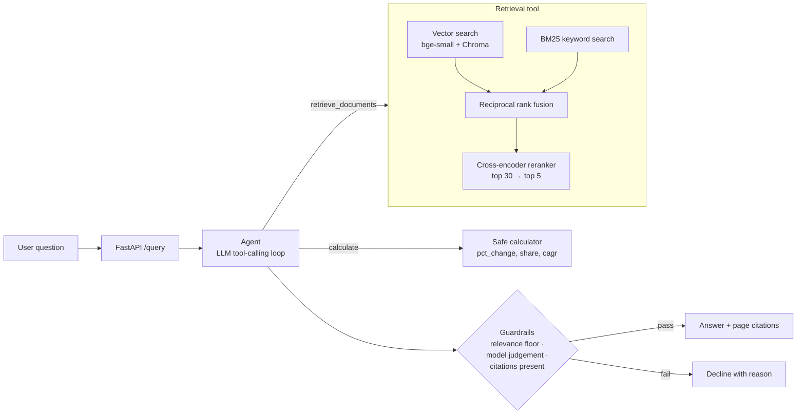

# Consulting Research Copilot

A question-answering assistant over public company annual reports, for the kind of desk research
a consulting case team does. Ask a business question; it retrieves the relevant passages and
tables, computes figures with a calculator tool, and answers with page-level citations. When the
reports do not support an answer, it declines instead of guessing.

**Corpus:** athletic apparel & footwear: Nike (FY2025 10-K), Lululemon (FY2024 10-K),
Under Armour (FY2025 10-K), Columbia Sportswear (FY2024 10-K), Deckers Brands (FY2025 Annual
Report). About 500 pages, 1,228 chunks.

**Headline result:** hybrid BM25 + vector retrieval with cross-encoder reranking finds a
supporting page in the top 5 for **76%** of a 25-question eval set, up from **56%** for the
vector-only baseline (MRR 0.43 → 0.54). CI enforces this on every push.

## Architecture



Ingestion, offline: `PDF → pypdf page text → 300-word chunks (50 overlap), one page each →
bge-small-en-v1.5 embeddings → Chroma`.

## Setup

Requires Python 3.12. Windows PowerShell shown; on macOS/Linux use `source .venv/bin/activate` and `cp`.

```powershell
python -m venv .venv
.venv\Scripts\Activate.ps1
pip install -r requirements-dev.txt
copy .env.example .env               # paste your OPENAI_API_KEY into .env
python scripts/download_data.py      # the five reports into data/
python -m copilot.cli ingest         # build the index (a few minutes on CPU)
python -m pytest                     # the LLM is mocked, no key needed
```

**Docker (one command after building):**

```bash
docker build -t consulting-copilot .          # bakes in reports, models and index
docker run -p 8000:8000 --env-file .env consulting-copilot
```

## Usage

```powershell
python -m copilot.cli search "How fast did HOKA grow?"          # retrieval only, no key
python -m copilot.cli agent  "By what percentage did Nike's net income fall in fiscal 2025?"
uvicorn copilot.api:app --port 8000                              # then open http://localhost:8000/docs
```

| Endpoint | Body | Returns |
|---|---|---|
| `POST /query` | `{"question": "..."}` | `answer`, `sources`, `tool_calls`, `fallback_triggered`, `fallback_reason` |
| `POST /search` | `{"question": "...", "k": 5}` | ranked passages with citation and score (no API key needed) |
| `GET /health` | | status, retriever mode, model, whether the LLM is configured |

### Example outputs

Retrieval (`search`, real output):

```
Q: Why did Nike's gross margin decline in fiscal 2025?
1. 6.880  Nike_FY2025_10K.pdf, p. 38
   GROSS MARGIN FISCAL 2025 COMPARED TO FISCAL 2024 For fiscal 2025, our consolidated gross profit
   decreased 14% to $19,790 million compared to $22,887 million for fiscal 2024. Gross margin decreased 190...
2. 5.023  Nike_FY2025_10K.pdf, p. 46
3. 4.876  Nike_FY2025_10K.pdf, p. 37
```

Agent response shape (`POST /query`, illustrative values):

```json
{
  "answer": "Gross margin decreased 190 basis points to 42.7% ... [1] ...",
  "sources": ["Nike_FY2025_10K.pdf, p. 38", "Nike_FY2025_10K.pdf, p. 32"],
  "tool_calls": {"retrieve_documents": 1, "calculate": 1},
  "fallback_triggered": false,
  "fallback_reason": null
}
```

Out-of-scope (`"Who won the 2022 FIFA World Cup?"`): the best passage scores -8.5, far below
the relevance floor of 2.0, so the agent returns *"The available reports do not contain this
information."* with `fallback_triggered: true`.

Full agent answers for four showcase queries are generated with
`python scripts/make_examples.py --final` into `docs/examples.md`.

## Evaluation

`evals/questions.json`: 25 questions, five per company (14 lookups, 7 "why" questions, 4
calculations), each with a reference answer, source report, supporting pages and a verbatim
evidence snippet. A test checks every snippet against its page, so the key cannot drift from the documents.

### Retrieval: before and after (no LLM, runs in CI)

| Retriever | Hit@1 | Hit@5 | MRR | Precision@5 | sec/query (CPU) |
|---|---|---|---|---|---|
| Vector only (Stage 1 baseline) | 0.32 | 0.56 | 0.43 | 0.17 | 0.3 |
| BM25 only | 0.24 | 0.60 | 0.39 | 0.18 | 0.01 |
| Hybrid (RRF) | 0.32 | 0.60 | 0.44 | 0.18 | 0.04 |
| **Hybrid + rerank (final)** | **0.40** | **0.76** | **0.54** | **0.24** | 4.4 |

Hit@k: a supporting page is in the top k. MRR: mean reciprocal rank of the first supporting page.
Precision@5: share of the top 5 chunks that come from a supporting page.

### Answer quality: RAGAS (LLM-judged)

| Metric | Vector baseline | Hybrid + rerank |
|---|---|---|
| Faithfulness | *pending* | *pending* |
| Answer relevancy | *pending* | *pending* |
| Context precision | *pending* | *pending* |
| Context recall | *pending* | *pending* |

Produced by `python evals/run_ragas_eval.py --final` (gpt-5.6-terra as generator and judge);
results land in `evals/results/ragas_final.json`.

### Guardrails

| Check | Result |
|---|---|
| Answerable questions clearing the relevance floor | 25/25 (lowest score 3.47 vs floor 2.0) |
| Out-of-scope questions declined by the floor alone | 6/8 |
| On-topic out-of-scope (Adidas revenue, Nike FY2030) | left to the model's `INSUFFICIENT_CONTEXT` judgement; measured by `evals/run_agent_eval.py` |

The floor is calibrated on the cross-encoder's score scale, so it applies only with the `hybrid_rerank` retriever (the default); with other retrievers the model-judgement and citation checks still apply.

## CI/CD

`.github/workflows/ci.yml` on every push:

1. Unit tests, with the LLM mocked
2. Download reports, build the index
3. **Retrieval regression gate:** fail if hybrid + rerank Hit@5 drops below 0.72
4. **Guardrail gate:** fail if any answerable question falls below the relevance floor
5. Agent eval with gpt-5.6-luna, if the `OPENAI_API_KEY` repository secret is set
6. RAGAS eval, on manual runs only (to control API cost)
7. On `main`: build the Docker image and smoke-test `/health` and `/search`

## Project structure

```
copilot/
  config.py       all settings (models, chunk sizes, thresholds)
  ingest.py       PDF → page-level chunks → Chroma
  embeddings.py   local sentence-transformers embeddings
  retrieval.py    vector, BM25, hybrid (RRF), reranked retrievers
  generate.py     single-shot RAG answer with citations (Stage 1)
  tools.py        retrieve_documents and a safe AST calculator
  agent.py        tool-use loop and fallback guardrails (Stage 3)
  evaluation.py   eval set loader and retrieval metrics
  api.py          FastAPI service
  cli.py          command-line interface
evals/            question set, out-of-scope set, retrieval / guardrail / agent / RAGAS runners
scripts/          report download, example generation
stage0/           foundation scripts: API call, embeddings, cosine similarity, chunking
tests/            pytest suite
```

## Design decisions

- **Page-level chunking.** Chunks never cross a page boundary, so every citation is an exact page.
  Each chunk is embedded with a short header ("Nike annual report, page 38.") so a bare
  financial table still carries its company.
- **bge-small over MiniLM for embeddings.** `all-MiniLM-L6-v2` truncates at 256 tokens and would
  ignore most of each 300-word passage; `bge-small-en-v1.5` reads 512.
- **Reranker chosen by measurement.** The brief suggested `bge-reranker-base`; on this eval set
  `ms-marco-MiniLM-L-6-v2` scored higher and ran about 4× faster on CPU:

  | Reranker (candidates) | Hit@5 | MRR | sec/query |
  |---|---|---|---|
  | bge-reranker-base (20) | 0.72 | 0.49 | ~16 |
  | bge-reranker-base (10) | 0.68 | 0.50 | 10.6 |
  | ms-marco-MiniLM-L-6-v2 (20) | 0.72 | 0.53 | 3.3 |
  | **ms-marco-MiniLM-L-6-v2 (30)** | **0.76** | **0.54** | 4.4 |

- **Guardrail threshold from data**, not intuition (see Guardrails above).
- **Manual tool loop, no agent framework.** About 100 lines, easy to test with a scripted fake client.
- **10-K print editions for Lululemon and Under Armour.** Their designed annual reports embed
  fonts without a text mapping, so text extraction produced gibberish.
- **Models:** OpenAI `gpt-5.6-luna` for development, `gpt-5.6-terra` for final evaluation runs
  (`--final`). Embeddings and reranking run locally.

## Limitations and next steps

- 6 of 25 questions still miss the top 5, mostly facts stated once in a highlights bullet list
  while many pages repeat the same terms. A company metadata filter on retrieval and
  table-aware chunking are the obvious next steps.
- Tables are extracted as flattened text; pdfplumber table extraction would help numeric questions.
- Cross-company comparison and GraphRAG are the optional Stage 5 in the brief.

## Stage history

| Tag | Stage | Content |
|---|---|---|
| (none) | 0 | Foundations: `stage0/` scripts |
| v0.1 | 1 | Basic RAG with citations, CLI |
| v0.2 | 2 | Eval set, baseline, hybrid search, reranking |
| v0.3 | 3 | Tool-calling agent, calculator, fallback guardrails |
| v1.0 | 4 | FastAPI, Docker, CI with eval regression gates |
