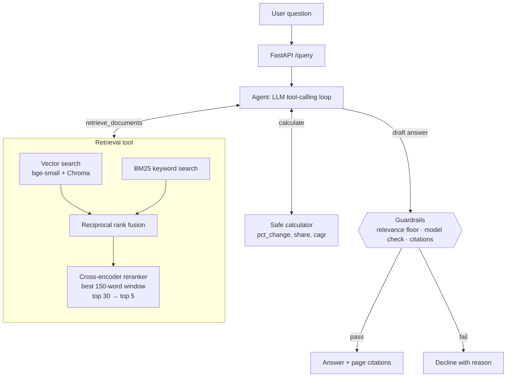

# Consulting Research Copilot

[](https://github.com/Ohm-Kel/consulting-research-copilot/actions/workflows/ci.yml)


A question-answering assistant for the desk research a consulting team does in the first days of
a project. Ask a business question about five companies' annual reports: it finds the relevant
passages and tables, works out figures with a calculator tool, and answers with **page-level
citations**. When the reports do not support an answer, it **declines instead of guessing**.

```
Q: How did Nike's gross margin change in fiscal 2025, and what did management say caused it?

Answer: Nike's consolidated gross margin declined 190 basis points, from 44.6% in fiscal 2024 to
42.7% in fiscal 2025. Gross profit fell 14% to $19,790 million. [1][2]
Management attributed the decline primarily to lower NIKE Brand average selling prices (about
180 bps), driven by higher discounts and channel-mix changes... partly offset by lower product
costs (~80 bps) and lower warehousing and logistics costs (~20 bps). [1]

Sources: [1] Nike_FY2025_10K.pdf, p. 38  [2] Nike_FY2025_10K.pdf, p. 35
```

*Real output from `gpt-5.6-terra`, checked against the 10-K. More in [docs/examples.md](docs/examples.md).*

## Results at a glance

|  | Development set (25 questions) | Held-out set (20 questions) |
|---|---|---|
| Answer passage in the top 5 search results | **88%** (vector-search baseline 60%) | **90%** (vector-search baseline 95%) |
| Questions answered by the agent | **25 / 25** | **20 / 20** |
| Answers citing a page that supports them | 24 / 25 | 20 / 20 |
| Calculations correct | **4 / 4** | **5 / 5** |
| Answers grounded in the retrieved text (RAGAS faithfulness) | 0.91 | 0.93 |
| Out-of-scope questions declined instead of guessed | **8 / 8** | not run |

The development questions were used to choose the design. The held-out questions were written
afterwards and are only ever scored, never tuned on. Retrieval improved clearly on the harder
development questions and stayed level on the easier held-out ones; [Evaluation](#evaluation)
explains why, with confidence intervals. Every number above comes from a file in
[`evals/results/`](evals/results), and the ones that need no LLM are re-measured by CI on every
push.

**Corpus:** athletic apparel and footwear. Nike (FY2025 10-K), Lululemon (FY2024 10-K), Under
Armour (FY2025 10-K), Columbia Sportswear (FY2024 10-K) and Deckers Brands (FY2025 Annual
Report): about 500 pages, split into 1,228 page-level chunks.

## How it works



1. **Ingestion.** Each PDF page is split into 300-word chunks that never cross a page boundary,
   so every citation points to one page. Chunks are embedded locally with `bge-small-en-v1.5`
   and stored in Chroma. Citations use PDF page numbers, which can differ from the numbers
   printed on the page.
2. **Hybrid retrieval.** Vector search finds passages with the same meaning; BM25 keyword search
   catches exact names and figures ("HOKA", "$4,689 million"). Their rankings are merged with
   reciprocal rank fusion, and a cross-encoder reranker re-reads the top 30 candidates to pick
   the best 5, scoring each chunk by its best-matching 150-word window.
3. **Agent.** An LLM (OpenAI `gpt-5.6`) decides when to search, searches again with different
   wording when results are weak, and calls a calculator for growth rates and margins instead of
   doing mental arithmetic. Each passage is labelled with its report and fiscal-year end, since
   fiscal years differ between companies. The loop is plain Python, with no agent framework.
4. **Guardrails.** The agent declines when no retrieved passage clears a relevance floor set
   from measured scores, when the model judges the passages insufficient, when a draft answer
   cites nothing or cites only passages below the floor, or when the question runs out of its
   time budget.
5. **Service.** A FastAPI endpoint, a Docker image, and a CI pipeline that re-runs the
   evaluation on every push and fails the build if retrieval quality drops.

## Evaluation

Every design decision was measured before it was kept. The evaluation needs no LLM for its
core metric, so it runs in CI, and every result carries a confidence interval because the
question sets are small.

### Question sets and scoring

- **Development set** ([`evals/questions.json`](evals/questions.json)): 25 questions, five per
  company: 14 lookups, 7 "why" questions and 4 calculations. All settings were chosen on it.
- **Held-out set** ([`evals/heldout_questions.json`](evals/heldout_questions.json)): 20
  questions, four per company, about facts the development set never asks about. Written after
  the design was fixed and never tuned on. Its answer key was audited once against the whole
  corpus, without looking at any retriever's output, so that other wordings of the same answer
  also count (a table row as well as the sentence that quotes it).
- **Evidence-level scoring.** Each question lists one or more *fact sets*: short strings copied
  from the report that together answer it, such as `46.3 billion` and `51.4 billion`. A
  retrieved chunk counts only if its own text contains a complete fact set, so the metric
  measures whether the model was actually shown the answer. Supporting pages are derived from
  the facts by [`evals/label_pages.py`](evals/label_pages.py), and a test fails if they drift
  from the documents.
- **Confidence intervals.** 95% bootstrap intervals over the questions. Pipelines are compared
  question by question (paired), which is more sensitive than comparing two averages.

### Retrieval

No LLM involved; CI re-runs this on every push.

Development set (25 questions):

| Retriever | Hit@1 | Hit@5 (95% CI) | MRR | Precision@5 | sec/query (CPU) |
|---|---|---|---|---|---|
| Vector only (baseline) | 0.40 | 0.60 (0.40–0.80) | 0.49 | 0.16 | 0.1 |
| BM25 only | 0.24 | 0.56 (0.36–0.76) | 0.40 | 0.16 | <0.01 |
| Hybrid (RRF) | 0.36 | 0.64 (0.44–0.80) | 0.47 | 0.18 | 0.05 |
| Hybrid + rerank, whole chunks (v1.3) | 0.48 | 0.68 (0.48–0.84) | 0.57 | 0.20 | 3.9 |
| **Hybrid + rerank, best window (default)** | **0.48** | **0.88 (0.76–1.00)** | **0.64** | **0.27** | 7.1 |
| Hybrid + rerank, best window, company-scoped | 0.48 | 0.88 (0.76–1.00) | 0.63 | 0.27 | ≈7 |

Held-out set (20 questions):

| Retriever | Hit@1 | Hit@5 (95% CI) | MRR | Precision@5 |
|---|---|---|---|---|
| Vector only (baseline) | 0.80 | 0.95 (0.85–1.00) | 0.85 | 0.38 |
| BM25 only | 0.35 | 0.60 (0.40–0.80) | 0.47 | 0.27 |
| Hybrid (RRF) | 0.55 | 1.00 | 0.74 | 0.39 |
| Hybrid + rerank, whole chunks (v1.3) | 0.65 | 0.90 (0.75–1.00) | 0.74 | 0.38 |
| **Hybrid + rerank, best window (default)** | **0.75** | **0.90 (0.75–1.00)** | **0.82** | **0.39** |

*Hit@k: an answer chunk is in the top k. MRR: mean reciprocal rank of the first answer chunk.
Precision@5: share of the top 5 chunks that contain the answer.*

What the two tables say together:

- **On the development set the gain is real.** Question by question, the default pipeline beats
  the vector baseline by +0.28 Hit@5 (95% CI +0.04 to +0.52). The earlier whole-chunk reranker
  gained only +0.08 (−0.12 to +0.28), which is indistinguishable from noise.
- **On the held-out set the pipelines are level.** These questions are easier: most answers sit
  in a single sentence, and vector search alone finds 19 of 20. The default pipeline is within
  noise of the baseline (−0.05 Hit@5, 95% CI −0.20 to +0.10) and ranks answers higher than the
  whole-chunk reranker did (Hit@1 0.65 → 0.75).
- **The honest claim** is that the default pipeline is clearly better on hard questions and no
  worse on easy ones. Part of the development-set gain comes from choosing settings on that set.
  Across all 45 questions it finds 40, against 34 for vector search, 36 for hybrid search and 35
  for whole-chunk reranking.

### Answer quality (RAGAS)

RAGAS scores single-shot answers written from the top 5 passages, without the agent.
`gpt-5.6-terra` writes the answers and `gpt-5.6-luna` judges them: using a different model as
judge matters, because a model tends to rate its own output highly.

| Metric (95% CI) | Vector baseline, dev | Default pipeline, dev | Default pipeline, held-out |
|---|---|---|---|
| Faithfulness | 0.94 (0.90–0.98) | 0.91 (0.85–0.96) | 0.93 (0.86–0.99) |
| Answer relevancy | 0.85 (0.74–0.93) | 0.84 (0.73–0.92) | 0.92 (0.89–0.94) |
| Context precision | 0.61 (0.46–0.75) | 0.76 (0.63–0.87) | 0.80 (0.66–0.92) |
| Context recall | 0.73 (0.57–0.89) | 0.90 (0.78–1.00) | 0.90 (0.75–1.00) |

- **The judge agrees that retrieval improved.** Question by question on the development set,
  context precision rises by +0.15 (95% CI +0.02 to +0.30) and context recall by +0.17 (−0.01 to
  +0.36).
- **Answers stay grounded.** Faithfulness and answer relevancy do not change beyond noise (−0.03
  and −0.01). When the evidence is missing, the answer says so instead of guessing; those
  answers are what score zero on answer relevancy.
- The vector-baseline run crashed after scoring every question but before saving, so its
  per-question scores were recovered from the run log; the results file holds those scores but
  not the answer text.

### Agent and guardrails

`gpt-5.6-luna`, the model the app uses by default:

| Check | Development (25) | Held-out (20) |
|---|---|---|
| Answerable questions answered (not declined) | 25 / 25 | 20 / 20 |
| Answers citing a supporting page | 24 / 25 | 20 / 20 |
| Calculation questions correct (±0.2 percentage points) | 4 / 4 | 5 / 5 |
| Out-of-scope questions declined | 8 / 8 | not run |

- The one answer without an expected citation (Under Armour revenue by region) is correct. It
  cites the detailed regional table on pages 38–39, while the answer key lists only the summary
  on page 33.
- Of the eight out-of-scope questions, the relevance floor stopped two before the model
  answered, and the model's own check declined the other six, including the two on-topic ones
  (Adidas revenue, Nike fiscal 2030).
- The agent writes its own search queries and can search again, so it answers some questions
  whose evidence the retrieval tables count as missed.
- All 53 questions cost $0.07 in API usage, at about 12 seconds each on a laptop CPU.

The relevance floor needs no LLM, so CI re-measures it on every push with the current retriever:

| Check | Result |
|---|---|
| Development questions clearing the floor | 25 / 25 (lowest score 5.35 vs floor 2.0) |
| Held-out questions clearing the floor | 20 / 20 (lowest score 4.45) |
| Out-of-scope declined by the floor alone | 6 / 8 (World Cup, iPhone, Puma, Skechers…; highest score 1.54) |

### What the evaluation taught me

- **My first metric was wrong, and I replaced it.** The original page-level metric counted a hit
  whenever any chunk from a "correct" page was retrieved (over-counting), and relied on a
  hand-made page list that missed valid pages (under-counting). It reported 56% → 76%. When the
  LLM-judged scores did not agree, I traced the gap and rebuilt the metric at the evidence level.
- **A plausible fix that did not help.** Restricting search to the company named in the
  question changed nothing: the remaining misses were the right report, wrong passage.
- **A held-out set changed the story.** On new questions the first reranker did not beat plain
  hybrid search, and the paired interval for its development-set gain included zero. Its
  60% → 68% headline was within noise.
- **The reranker was reading the wrong unit.** The cross-encoder was trained on short
  passages, and a 300-word chunk buries the one sentence that answers the question. Scoring
  each chunk by its best 150-word window lifted development Hit@5 to 0.88 without touching the
  index.
- **My own answer key was too narrow.** The first held-out key accepted one wording per fact
  and scored valid passages as misses. Auditing it against the corpus moved every pipeline up,
  so I now check the key before I blame the retriever.
- **A model marking its own work is generous.** Faithfulness was 0.97 when the same model wrote
  and judged the answers, and 0.91–0.94 with a separate judge.

## Engineering

| Area | What is in place |
|---|---|
| API | FastAPI: `POST /query` (agent), `POST /search` (retrieval only, no LLM), `GET /health`. Optional API-key auth (`X-API-Key`), per-client rate limits (429 with `Retry-After`), LLM errors returned as 502 |
| Tests | 127 pytest tests. The LLM is replaced by a scripted fake, so the suite runs without an API key |
| Safety | Calculator built on Python's AST (no `eval`), with a size cap and checks for overflow and complex results. A 90-second timeout on every OpenAI call and a 3-minute budget per question |
| Observability | One JSON log line per question: model, tool calls, LLM calls, tokens, time, estimated cost and any fallback reason. `/query` returns the same usage. The paid evaluation runners count tokens, retry a failed question once and save progress as they go |
| Reproducibility | Every report is checked against a SHA-256 checksum. The index stores the settings it was built with and refuses to load if the configuration has changed |
| Security | API keys only through `.env`, which is never committed. GitHub secret scanning with push protection. Dependency alerts reviewed: the open chromadb and ragas advisories need components this project does not use (notes in [`requirements.txt`](requirements.txt)) |
| Docker | One image containing the reports, the models and a pre-built index |
| CI | GitHub Actions: lint, format and type checks (ruff, mypy) → tests → build index → **retrieval regression gate** (Hit@5 ≥ 0.84) → held-out retrieval report → **guardrail gate** → Docker build and smoke test |

## Quick start

Requires Python 3.12. Commands are shown for Windows PowerShell; on macOS or Linux use
`source .venv/bin/activate` and `cp`.

```powershell
git clone https://github.com/Ohm-Kel/consulting-research-copilot.git
cd consulting-research-copilot
python -m venv .venv
.venv\Scripts\Activate.ps1
pip install -r requirements-dev.txt
copy .env.example .env               # add your OPENAI_API_KEY
python scripts/download_data.py      # the five reports into data/
python -m copilot.cli ingest         # build the index (a few minutes on CPU)
python -m pytest                     # no API key needed
```

Ask questions from the command line:

```powershell
python -m copilot.cli search "How fast did HOKA grow?"     # retrieval only, no API key needed
python -m copilot.cli agent "How much did Nike's net income fall in fiscal 2025?"
```

Or run the API (interactive docs at http://localhost:8000/docs):

```powershell
uvicorn copilot.api:app --port 8000
```

and call it from a second terminal:

```powershell
Invoke-RestMethod -Method Post http://localhost:8000/query -ContentType "application/json" `
  -Body '{"question": "How much did Nike spend on demand creation in fiscal 2025?"}'
```

On macOS or Linux: `curl -X POST localhost:8000/query -H "content-type: application/json" -d '{"question": "..."}'`.
`/search` takes the same body plus an optional `"k"` and needs no API key.

With Docker:

```bash
docker build -t consulting-research-copilot .
docker run -p 8000:8000 --env-file .env consulting-research-copilot
```

### Reproduce the evaluation

```powershell
python evals/run_retrieval_eval.py                 # retrieval, development set (free, about 10 min on CPU)
python evals/run_retrieval_eval.py --set heldout   # retrieval, held-out set (free)
python evals/run_guardrail_eval.py                 # relevance-floor check (free)
python evals/run_agent_eval.py                     # agent, development set (OpenAI API, about $0.05)
python evals/run_agent_eval.py --set heldout       # agent, held-out set (about $0.03)
python evals/run_ragas_eval.py --final             # RAGAS, development set, both pipelines (about $0.60)
python evals/run_ragas_eval.py --final --set heldout --modes hybrid_rerank   # about $0.22
```

With `make` (Linux, macOS, WSL) the same steps are shortcuts: `make install`, `make data`,
`make index`, `make test`, `make lint`, `make eval`, `make eval-llm`, `make serve` and
`make docker-build`. Run `make` on its own to list them.

## Project structure

```
copilot/
  config.py       all settings: models, chunk sizes, thresholds
  ingest.py       PDF → page-level chunks → Chroma
  embeddings.py   local sentence-transformers embeddings
  retrieval.py    vector, BM25, hybrid (RRF), reranked and company-scoped retrievers
  generate.py     single-shot RAG answer with citations
  tools.py        retrieve_documents and the safe calculator
  agent.py        tool-calling loop and fallback guardrails
  evaluation.py   question sets, fact matching, evidence-level metrics, bootstrap intervals
  api.py          FastAPI service
  cli.py          command-line interface
evals/            question sets, page labeller, evaluation runners and results/
scripts/          report download and example generation
stage0/           first learning scripts: API call, embeddings, cosine similarity, chunking
tests/            pytest suite
pyproject.toml    project metadata and tool settings
Makefile          shortcuts for setup, tests, linting, evaluation and Docker
```

## Design decisions

- **Page-level chunks with a company header.** Each chunk is embedded with a short header
  ("Nike annual report, page 38.") so a bare financial table still carries its company.
- **`bge-small-en-v1.5` rather than `all-MiniLM-L6-v2` for embeddings.** MiniLM truncates at 256
  tokens and would ignore most of each 300-word passage; bge-small reads 512.
- **Reranker model chosen by measurement.** Scoring whole chunks, `ms-marco-MiniLM-L-6-v2`
  matched `bge-reranker-base` on Hit@5, beat it on Hit@1 and MRR, and ran about 3.5× faster on
  CPU:

  | Reranker (candidates) | Hit@1 | Hit@5 | MRR | sec/query |
  |---|---|---|---|---|
  | bge-reranker-base (20) | 0.36 | 0.68 | 0.50 | 16.2 |
  | bge-reranker-base (10) | 0.40 | 0.64 | 0.49 | 9.7 |
  | ms-marco-MiniLM-L-6-v2 (20) | 0.48 | 0.64 | 0.57 | 3.1 |
  | **ms-marco-MiniLM-L-6-v2 (30)** | **0.48** | **0.68** | **0.57** | 4.7 |

- **The reranker scores a chunk by its best window (MaxP).** Each candidate is split into
  150-word windows that overlap by half, and the chunk takes its highest window score. The
  index, the citations and the text the LLM reads are unchanged. The 150-word size follows the
  BERT-MaxP setup (Dai & Callan, 2019) rather than the best cell of my own grid, and every size
  I tried on the development set landed on the same plateau:

  | Window (30 candidates, dev set) | Hit@1 | Hit@5 | MRR |
  |---|---|---|---|
  | Whole chunk (300 words) | 0.48 | 0.68 | 0.57 |
  | 96 words | 0.60 | 0.84 | 0.70 |
  | 128 words | 0.44 | 0.88 | 0.63 |
  | **150 words (default)** | **0.48** | **0.88** | **0.64** |
  | 160 words | 0.48 | 0.88 | 0.64 |

  The cost is time: about 7 seconds per search on a laptop CPU instead of 4. Using 20
  candidates instead of 30 was faster but lost answers (0.76–0.80), and forcing the top 5 to
  come from different pages made no consistent difference.
- **Relevance floor set from data.** Every answerable development question scores at least 5.35
  and unrelated or other-company questions at most 1.54, so the floor is 2.0. It sits near the
  low end on purpose: a question that wrongly passes still meets the model's own check, while
  one that is wrongly blocked is simply refused. It applies only to reranker scores, the scale
  it was calibrated on.
- **OpenAI Responses API for the agent.** GPT-5.6 models reject function tools combined with
  reasoning on Chat Completions.
- **10-K print editions for Lululemon and Under Armour.** Their designed annual reports embed
  fonts without a text mapping, so text extraction produced gibberish.
- **Models.** `gpt-5.6-luna` is the app's default and runs the agent evaluation;
  `gpt-5.6-terra` writes the answers that RAGAS scores, with luna as the judge. Embeddings and
  reranking run locally for free. The v1.4 evaluation runs cost about $0.90 in API usage, and
  the whole project under $5.

## Limitations and next steps

- **5 of 45 questions still miss the top 5**, all within the right report. One is a wording gap
  that query rewriting should fix: the question asks how many people Under Armour "employs",
  and the report counts "teammates". The others ask for figures that sit mostly in financial
  tables.
- **Small evaluation sets.** With 25 + 20 questions the intervals are wide, and the development
  set has now been used to choose several settings. More held-out questions, especially harder
  ones, are the most valuable next step.
- **Tables are flattened to text.** Structured table extraction (for example with pdfplumber)
  would help numeric questions.
- **Slower search.** Windowed reranking roughly doubles reranking time on CPU.
- **Cross-company comparison** works through the agent (see [docs/examples.md](docs/examples.md))
  but is not yet part of the evaluation.

## Release history

| Tag | Content |
|---|---|
| (none) | Stage 0: foundation scripts in `stage0/` |
| v0.1 | Stage 1: basic RAG with page citations and a CLI |
| v0.2 | Stage 2: evaluation set, hybrid search, reranking |
| v0.3 | Stage 3: tool-calling agent, calculator, fallback guardrails |
| v1.0 | Stage 4: FastAPI, Docker, CI with evaluation regression gates |
| v1.0.1 | Hardening fixes from a full code review |
| v1.1 | OpenAI provider, evidence-level metric, full LLM-judged results |
| v1.2 | MIT licence, packaging, linting, docstrings, clearer CLI errors |
| v1.3 | Fiscal-year labels, stricter citation guardrail, timeouts, checksummed data, CI hardening |
| v1.4 | Held-out question set, confidence intervals, windowed reranker scoring, independent RAGAS judge, API auth and rate limits, usage tracking, type checking |

## License

Released under the [MIT License](LICENSE). Copyright (c) 2026 Semanu Kwaku Sebuava.
