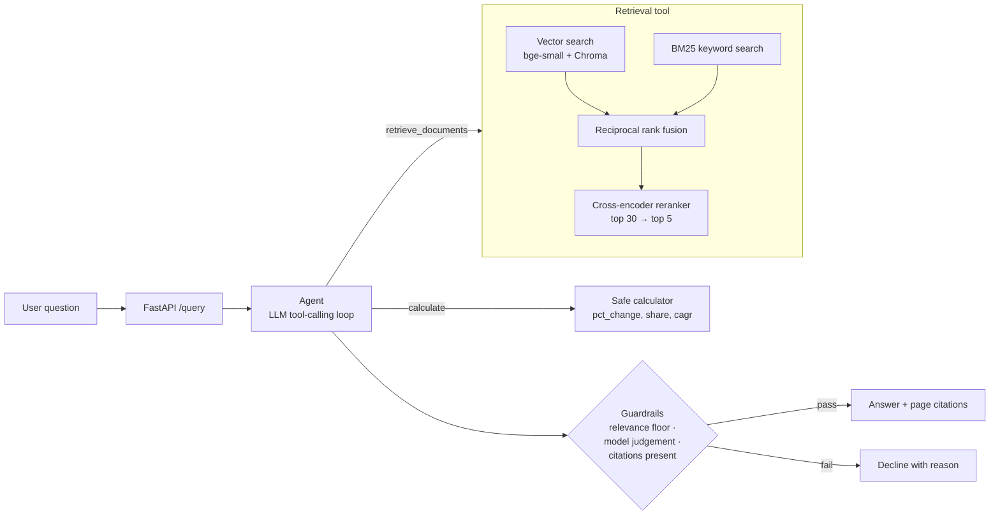

# Consulting Research Copilot

A question-answering assistant over public company annual reports, for the kind of desk research
a consulting case team does. Ask a business question; it retrieves the relevant passages and
tables, computes figures with a calculator tool, and answers with page-level citations. When the
reports do not support an answer, it declines instead of guessing.

**Corpus:** athletic apparel & footwear: Nike (FY2025 10-K), Lululemon (FY2024 10-K),
Under Armour (FY2025 10-K), Columbia Sportswear (FY2024 10-K), Deckers Brands (FY2025 Annual
Report). About 500 pages, 1,228 chunks.

**Headline results** (25-question eval set, final model `gpt-5.6-terra`):

- Retrieval: hybrid BM25 + vector search with cross-encoder reranking puts a passage that
  actually contains the answer in the top 5 for **68%** of questions, up from **60%** for the
  vector-only baseline (MRR 0.49 → 0.57, top-1 hit rate 0.40 → 0.48).
- Agent: answered 24/25 questions, cited a supporting page in 23 of 24 answers, got 4/4
  calculations right, and **declined 8/8 out-of-scope questions** instead of guessing.
- RAGAS: faithfulness 0.97 (answers stick to the retrieved text).

## Architecture



Ingestion, offline: `PDF → pypdf page text → 300-word chunks (50 overlap), one page each →
bge-small-en-v1.5 embeddings → Chroma`.

## Setup

Requires Python 3.12. Windows PowerShell shown; on macOS/Linux use `source .venv/bin/activate` and `cp`.

```powershell
python -m venv .venv
.venv\Scripts\Activate.ps1
pip install -r requirements-dev.txt
copy .env.example .env               # paste your OPENAI_API_KEY into .env
python scripts/download_data.py      # the five reports into data/
python -m copilot.cli ingest         # build the index (a few minutes on CPU)
python -m pytest                     # the LLM is mocked, no key needed
```

**Docker (one command after building):**

```bash
docker build -t consulting-copilot .          # bakes in reports, models and index
docker run -p 8000:8000 --env-file .env consulting-copilot
```

## Usage

```powershell
python -m copilot.cli search "How fast did HOKA grow?"          # retrieval only, no key
python -m copilot.cli agent  "By what percentage did Nike's net income fall in fiscal 2025?"
uvicorn copilot.api:app --port 8000                              # then open http://localhost:8000/docs
```

| Endpoint | Body | Returns |
|---|---|---|
| `POST /query` | `{"question": "..."}` | `answer`, `sources`, `tool_calls`, `fallback_triggered`, `fallback_reason` |
| `POST /search` | `{"question": "...", "k": 5}` | ranked passages with citation and score (no API key needed) |
| `GET /health` | | status, retriever mode, model, whether the LLM is configured |

### Example outputs

Retrieval (`search`, real output):

```
Q: Why did Nike's gross margin decline in fiscal 2025?
1. 6.880  Nike_FY2025_10K.pdf, p. 38
   GROSS MARGIN FISCAL 2025 COMPARED TO FISCAL 2024 For fiscal 2025, our consolidated gross profit
   decreased 14% to $19,790 million compared to $22,887 million for fiscal 2024. Gross margin decreased 190...
2. 5.023  Nike_FY2025_10K.pdf, p. 46
3. 4.876  Nike_FY2025_10K.pdf, p. 37
```

Agent (`python -m copilot.cli agent ...`, real output from `gpt-5.6-terra`):

```
Q: By what percentage did Lululemon's net income grow in 2024?
Answer: Lululemon's net income grew 17.1% in fiscal 2024, rising from $1.550 billion in 2023
to $1.815 billion in 2024. [1][2]
Sources: [1] Lululemon_FY2024_10K.pdf, p. 32  [2] Lululemon_FY2024_10K.pdf, p. 49
Tool calls: retrieve_documents (1), calculate (1)
Fallback triggered: false

Q: What was Adidas's revenue in 2024?
Answer: The available reports do not contain this information.
Tool calls: retrieve_documents (1)
Fallback triggered: true
```

Out-of-scope (`"Who won the 2022 FIFA World Cup?"`): the best passage scores -8.5, far below
the relevance floor of 2.0, so the agent returns *"The available reports do not contain this
information."* with `fallback_triggered: true`.

More real answers, including a Nike gross-margin bridge and an Under Armour vs Deckers
comparison, are in [docs/examples.md](docs/examples.md) (`python scripts/make_examples.py --final`).

## Evaluation

`evals/questions.json`: 25 questions, five per company (14 lookups, 7 "why" questions, 4
calculations). Each has a reference answer, the source report, and one or more **fact sets**:
short strings copied from the report that together answer the question (for example
`46.3 billion` + `51.4 billion`, or the table figures `46,309` + `51,362`).

- A retrieved chunk counts as relevant only if **its own text contains every fact of one set**,
  so the metric measures whether the model was actually shown the evidence.
- Each question's supporting pages are derived from the facts by `evals/label_pages.py`, not
  hand-picked; a test fails if they drift or if any question has no evidence chunk.

### Retrieval (no LLM, runs in CI)

| Retriever | Hit@1 | Hit@5 | MRR | Precision@5 | sec/query (CPU) |
|---|---|---|---|---|---|
| Vector only (Stage 1 baseline) | 0.40 | 0.60 | 0.49 | 0.16 | 0.3 |
| BM25 only | 0.24 | 0.56 | 0.40 | 0.16 | <0.01 |
| Hybrid (RRF) | 0.36 | 0.64 | 0.47 | 0.18 | 0.04 |
| **Hybrid + rerank (default)** | **0.48** | **0.68** | **0.57** | **0.20** | 3.4 |
| Hybrid + rerank, company-scoped | 0.48 | 0.68 | 0.56 | 0.20 | 3.6 |

Hit@k: an evidence chunk is in the top k. MRR: mean reciprocal rank of the first evidence
chunk. Precision@5: share of the top 5 chunks that contain the evidence.

With 25 questions, one question is 4 points, so the gain is two questions at top 5 and two at top 1.
Restricting search to the company named in the question changed nothing: the 8 remaining
misses are all *within* the right report (see Limitations).

### Answer quality: RAGAS (LLM-judged, `gpt-5.6-terra` as generator and judge)

| Metric | Vector baseline | Hybrid + rerank |
|---|---|---|
| Faithfulness | 0.97 | 0.97 |
| Answer relevancy | 0.85 | 0.84 |
| Context precision | 0.68 | 0.73 |
| Context recall | 0.80 | 0.75 |

Reranking puts relevant passages higher (context precision +0.05), but end-to-end answer
quality is statistically indistinguishable on 25 questions: each pipeline wins some questions
the other loses. Faithfulness is high for both, meaning answers stay grounded in whatever was
retrieved. Reproduce with `python evals/run_ragas_eval.py --final`.

### Agent (`python evals/run_agent_eval.py --final`)

| Check | Result |
|---|---|
| Answerable questions answered (not declined) | 24/25 |
| Answers citing a supporting page | 23/24 |
| Calculation questions with the correct percentage (±0.2 pts) | 4/4 |
| Out-of-scope questions declined | 8/8 |
| Tool calls over 33 questions | 40 searches, 6 calculations |

The one decline (Deckers headcount) is a retrieval miss the agent correctly refused to guess past.

### Guardrails

| Check | Result |
|---|---|
| Answerable questions clearing the relevance floor | 25/25 (lowest score 3.47 vs floor 2.0) |
| Out-of-scope questions declined by the floor alone | 6/8 (World Cup, iPhone, Puma, Skechers...) |
| On-topic out-of-scope (Adidas revenue, Nike FY2030) | declined by the model's `INSUFFICIENT_CONTEXT` judgement (2/2) |

The floor is calibrated on the cross-encoder's score scale, so it applies only to reranked
retrievers (the default); with other retrievers the model-judgement and citation checks still apply.

## CI/CD

`.github/workflows/ci.yml` on every push:

1. Unit tests, with the LLM mocked
2. Download reports, build the index
3. **Retrieval regression gate:** fail if hybrid + rerank Hit@5 drops below 0.64 (current 0.68; one question = 0.04)
4. **Guardrail gate:** fail if any answerable question falls below the relevance floor
5. Agent eval with gpt-5.6-luna, if the `OPENAI_API_KEY` repository secret is set
6. RAGAS eval, on manual runs only (to control API cost)
7. On `main`: build the Docker image and smoke-test `/health` and `/search`

## Project structure

```
copilot/
  config.py       all settings (models, chunk sizes, thresholds)
  ingest.py       PDF → page-level chunks → Chroma
  embeddings.py   local sentence-transformers embeddings
  retrieval.py    vector, BM25, hybrid (RRF), reranked and company-scoped retrievers
  generate.py     single-shot RAG answer with citations (Stage 1)
  tools.py        retrieve_documents and a safe AST calculator
  agent.py        tool-use loop and fallback guardrails (Stage 3)
  evaluation.py   eval set, fact matching and evidence-level retrieval metrics
  api.py          FastAPI service
  cli.py          command-line interface
evals/            question set, out-of-scope set, page labeller, retrieval / guardrail / agent / RAGAS runners
scripts/          report download, example generation
stage0/           foundation scripts: API call, embeddings, cosine similarity, chunking
tests/            pytest suite
```

## Design decisions

- **Page-level chunking.** Chunks never cross a page boundary, so every citation is an exact page.
  Each chunk is embedded with a short header ("Nike annual report, page 38.") so a bare
  financial table still carries its company.
- **bge-small over MiniLM for embeddings.** `all-MiniLM-L6-v2` truncates at 256 tokens and would
  ignore most of each 300-word passage; `bge-small-en-v1.5` reads 512.
- **Reranker chosen by measurement.** The brief suggested `bge-reranker-base`; on this eval set
  `ms-marco-MiniLM-L-6-v2` matched it on Hit@5, beat it on Hit@1 and MRR, and ran about 3.5×
  faster on CPU:

  | Reranker (candidates) | Hit@1 | Hit@5 | MRR | sec/query |
  |---|---|---|---|---|
  | bge-reranker-base (20) | 0.36 | 0.68 | 0.50 | 16.2 |
  | bge-reranker-base (10) | 0.40 | 0.64 | 0.49 | 9.7 |
  | ms-marco-MiniLM-L-6-v2 (20) | 0.48 | 0.64 | 0.57 | 3.1 |
  | **ms-marco-MiniLM-L-6-v2 (30)** | **0.48** | **0.68** | **0.57** | 4.7 |

- **Guardrail threshold from data**, not intuition (see Guardrails above).
- **Manual tool loop, no agent framework.** About 100 lines, easy to test with a scripted fake client.
  It uses the OpenAI **Responses API**: GPT-5.6 models reject function tools combined with
  reasoning on Chat Completions.
- **Evidence-level metric, not page-level.** An earlier page-level version over-counted (a chunk
  from the right page without the answer counted as a hit) and under-counted (valid pages missing
  from a hand-made key). Switching changed the headline from 56% → 76% to the honest 60% → 68%.
- **10-K print editions for Lululemon and Under Armour.** Their designed annual reports embed
  fonts without a text mapping, so text extraction produced gibberish.
- **Models:** OpenAI `gpt-5.6-luna` for development, `gpt-5.6-terra` for final evaluation runs
  (`--final`). Embeddings and reranking run locally. `evals/run_ragas_eval.py` patches a ragas
  0.4.3 bug that sends `max_tokens` to `gpt-5.6-*` models (its GPT-5 detection cannot parse "5.6").

## Limitations and next steps

- 8 of 25 questions still miss the top 5 (e.g. Under Armour and Deckers headcount, Nike demand
  creation). All are within-report misses: the right company, the wrong passage among pages that
  repeat the same terms, so a company filter does not help. Smaller or section-aware chunks and
  query rewriting are the next experiments, validated on new questions to avoid overfitting these 25.
- 25 questions is a small sample; differences of a few points are within noise.
- Tables are extracted as flattened text; pdfplumber table extraction would help numeric questions.
- Cross-company comparison and GraphRAG are the optional Stage 5 in the brief.

## Stage history

| Tag | Stage | Content |
|---|---|---|
| (none) | 0 | Foundations: `stage0/` scripts |
| v0.1 | 1 | Basic RAG with citations, CLI |
| v0.2 | 2 | Eval set, baseline, hybrid search, reranking |
| v0.3 | 3 | Tool-calling agent, calculator, fallback guardrails |
| v1.0 | 4 | FastAPI, Docker, CI with eval regression gates |
| v1.0.1 | 4 | Hardening fixes from a full code review |
| v1.1 | 4 | OpenAI provider, evidence-level retrieval metric, first full LLM-judged results |
